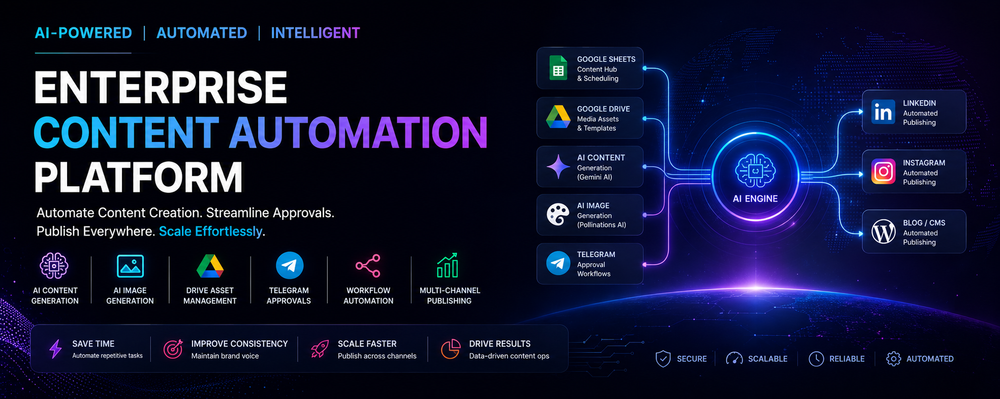
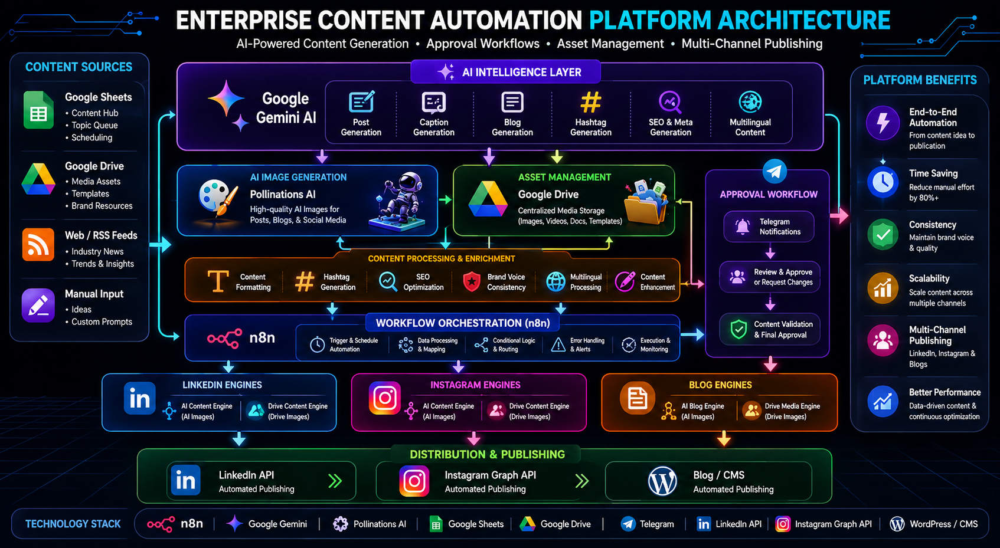
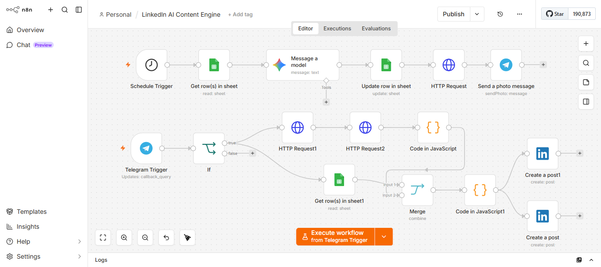
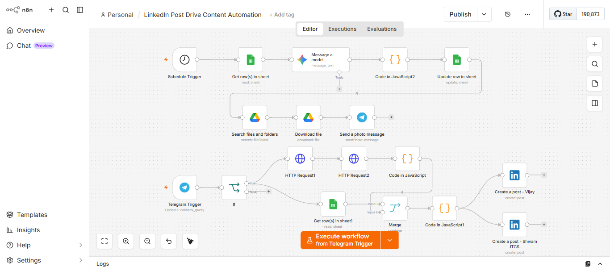
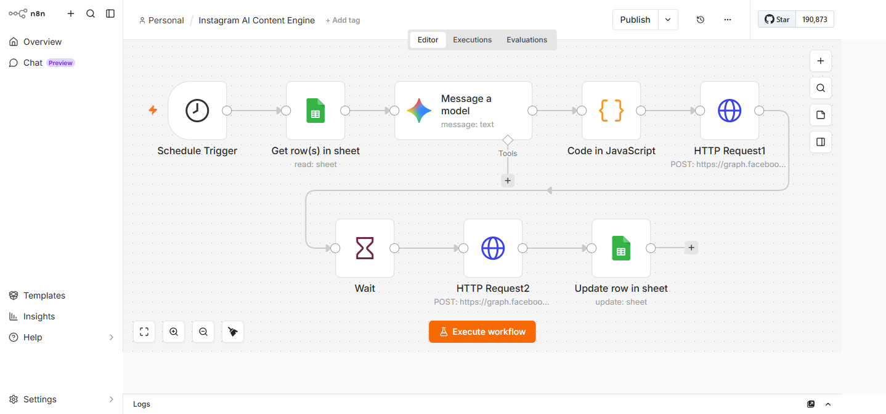
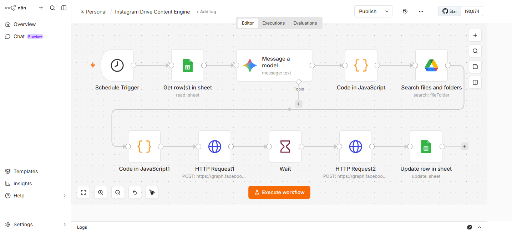
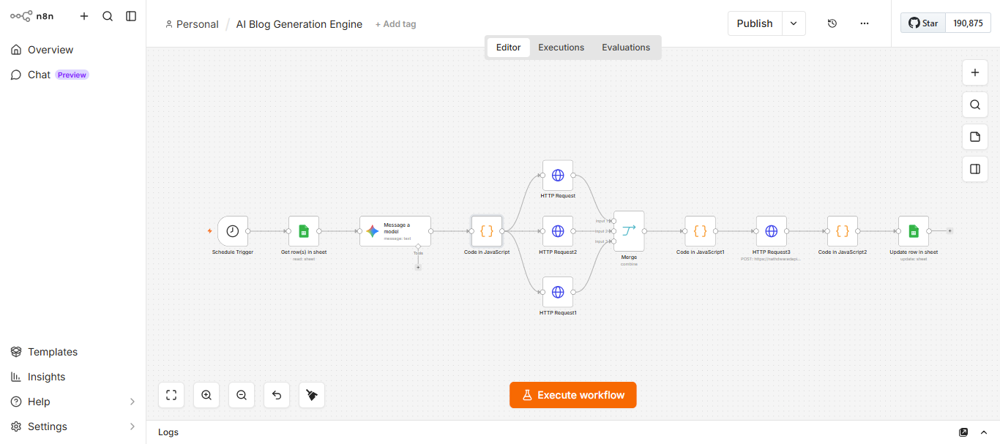
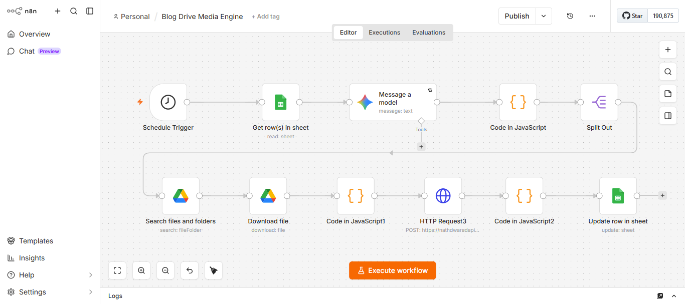

# 🚀 Enterprise Content Automation Platform


Enterprise-grade AI-powered content automation platform engineered for intelligent content generation, approval workflows, image orchestration, multilingual publishing, and automated distribution across LinkedIn, Instagram, and Blog ecosystems.

### Core Integrations


---

<p align="center">
  
</p>

---

# Platform Vision

Modern organizations spend significant time creating, reviewing, approving, and distributing content across multiple channels.

The Enterprise Content Automation Platform centralizes AI content generation, image creation, approval workflows, asset management, and publishing operations into a unified automation ecosystem.

Designed for scalable content operations, the platform combines AI intelligence, workflow orchestration, and multichannel distribution into one automated infrastructure.

---

# Business Problem

Content teams often struggle with:

* Manual content creation
* Repetitive publishing workflows
* Inconsistent branding
* Slow approval cycles
* Multi-platform distribution overhead
* Asset management complexity
* Lack of workflow visibility

As organizations scale, content operations become fragmented across tools, teams, and publishing channels.

---

# Solution

The platform automates the complete content lifecycle:

1. Content Generation
2. Image Generation / Asset Retrieval
3. Approval Workflow
4. Content Validation
5. Multi-Channel Distribution
6. Publishing Automation

This enables organizations to publish content faster while maintaining consistency, governance, and operational efficiency.

---

# Platform Highlights

* AI-Powered Content Generation
* AI Image Generation
* Google Drive Asset Integration
* Telegram Approval Workflows
* LinkedIn Publishing Automation
* Instagram Publishing Automation
* Blog Publishing Automation
* Multilingual Content Support
* Event-Driven Workflow Architecture
* Scalable Automation Infrastructure

---

# Platform Metrics

| Metric | Value |
|----------|----------|
| Automation Engines | 6 |
| Distribution Channels | 3 |
| Approval Workflow | Telegram-Based |
| AI Provider | Google Gemini |
| Asset Sources | AI + Google Drive |
| Publishing Targets | LinkedIn, Instagram, Blog |
| Workflow Engine | n8n |
| Content Types | Posts, Captions, Blogs, Images |

---

## Automation Portfolio

| Engine | Purpose |
|----------|----------|
| LinkedIn AI Content Engine | AI content + AI image publishing |
| LinkedIn Drive Content Engine | Drive assets + AI publishing |
| Instagram AI Content Engine | AI captions + AI images |
| Instagram Drive Content Engine | Drive assets + Instagram publishing |
| AI Blog Generation Engine | AI blog + AI images |
| Blog Drive Media Engine | Drive media + blog publishing |

---

# Core Automation Engines

## LinkedIn AI Content Engine

Generates founder-level LinkedIn content, AI-generated images, approval workflows, and automated publishing.

### Capabilities

* AI post generation
* AI image generation
* Telegram approvals
* Multi-account publishing
* Automated scheduling

---

## LinkedIn Drive Content Engine

Automates LinkedIn publishing using Google Drive managed assets combined with AI-generated content.

### Capabilities

* Drive asset retrieval
* AI content generation
* Approval workflows
* Automated publishing

---

## Instagram AI Content Engine

Creates Instagram-ready captions, hashtags, AI-generated visuals, and automated publishing workflows.

### Capabilities

* AI captions
* AI image generation
* Hashtag generation
* Instagram publishing

---

## Instagram Drive Content Engine

Publishes content using Google Drive managed creative assets and AI-generated captions.

### Capabilities

* Asset management
* AI captions
* Automated publishing
* Workflow orchestration

---

## AI Blog Generation Engine

Generates SEO-optimized blogs, AI images, metadata, and multilingual content automatically.

### Capabilities

* Blog generation
* AI image generation
* SEO metadata
* Multi-language support
* CMS-ready publishing

---

## Blog Drive Media Engine

Combines Google Drive media assets with AI-generated blog content for automated publishing workflows.

### Capabilities

* Drive image integration
* AI content generation
* Publishing automation
* Content orchestration

---

# Technology Stack

## AI Layer

* Google Gemini
* Prompt Engineering
* Content Intelligence Workflows
* AI Image Generation

---

## Workflow Orchestration

* n8n
* Event-Driven Automation
* Scheduling Infrastructure
* Approval Pipelines

---

## Data Layer

* Google Sheets
* Google Drive
* Workflow Metadata

---

## Communication Layer

* Telegram Bot API
* Approval Notifications
* Operational Alerts

---

## Distribution Layer

* LinkedIn API
* Instagram Graph API
* Blog Publishing APIs

---

# System Architecture

The platform follows an event-driven content automation architecture designed for scalable content operations and automated publishing workflows.

<p align="center">
  
</p>

---

# Workflow Previews

## LinkedIn AI Content Engine

<p align="center">
  
</p>

---

## LinkedIn Drive Content Engine

<p align="center">
  
</p>

---

## Instagram AI Content Engine

<p align="center">
  
</p>

---

## Instagram Drive Content Engine

<p align="center">
  
</p>

---

## AI Blog Generation Engine

<p align="center">
  
</p>

---

## Blog Drive Media Engine

<p align="center">
  
</p>

---

# Content Flow

Google Sheets / Content Queue

↓

AI Content Generation

↓

AI Images / Drive Assets

↓

Approval Workflow

↓

Content Validation

↓

Publishing Automation

↓

LinkedIn / Instagram / Blog Distribution

---

# Business Impact

The platform enables organizations to:

* Reduce manual publishing effort
* Improve content consistency
* Accelerate approval cycles
* Scale content operations
* Automate distribution workflows
* Improve operational efficiency

---

# Repository Structure

```txt
assets/
├── architecture/
├── branding/
└── screenshots/

workflows/
├── linkedin-ai-content-engine/
├── linkedin-drive-content-engine/
├── instagram-ai-content-engine/
├── instagram-drive-content-engine/
├── ai-blog-generation-engine/
└── blog-drive-media-engine/
```

# Product Roadmap

### Phase 1

* Content Automation
* Approval Workflows
* Publishing Automation

### Phase 2

* Multi-Agent Content Systems
* AI Content Optimization
* Intelligent Scheduling

### Phase 3

* Enterprise Analytics
* Workflow Intelligence
* Content Performance Monitoring

### Phase 4

* Agentic AI Operations
* Autonomous Publishing
* Enterprise Content Intelligence

---

# Engineering Vision

The Enterprise Content Automation Platform is engineered to transform content operations through AI-driven automation, scalable workflow orchestration, and intelligent publishing infrastructure.

The goal is to build a future-ready content operations ecosystem capable of supporting modern enterprises, agencies, and digital-first organizations.

---

# 📄 License

MIT License

Copyright © 2026 SHIVAM ITCS
